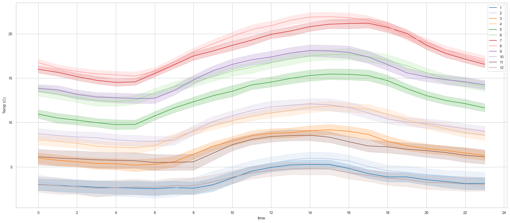
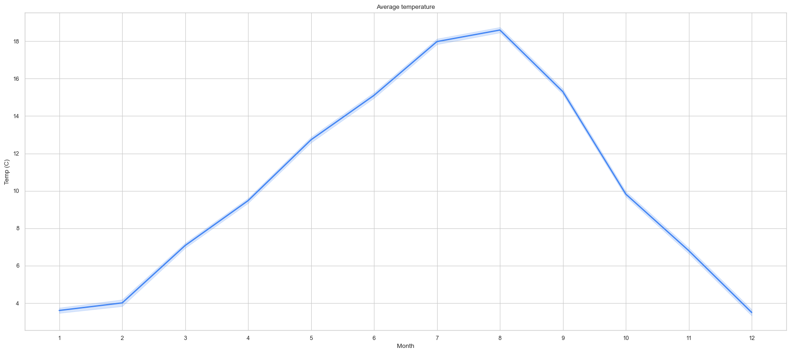

## NILM dataset

- [AMPds2: The Almanac of Minutely Power dataset (Version 2)](https://dataverse.harvard.edu/dataset.xhtml?persistentId=doi:10.7910/DVN/FIE0S4)
- [HUE: The Hourly Usage of Energy Dataset for Buildings in British Columbia](https://dataverse.harvard.edu/dataset.xhtml?persistentId=doi:10.7910/DVN/N3HGRN)

## Canada's 4 Seasons

### Winter

- November ... **December, January, and February** ...March, early April
- -20°C

### Spring

- February **April - June**
- Above 0°C

## Weather Data

